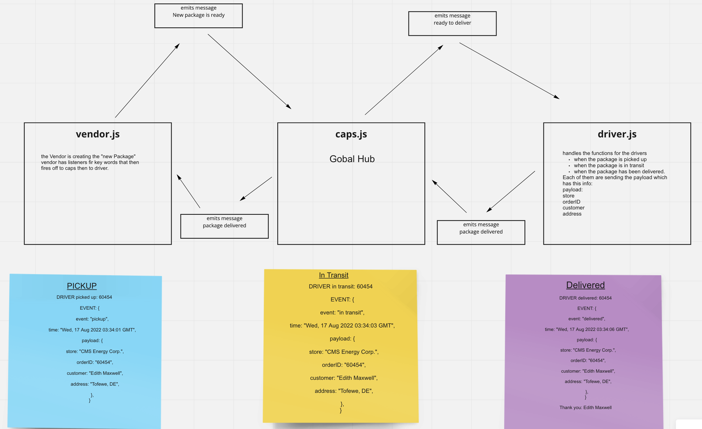

# Event Driven Applications
Today, we will leverage the ability of Javascript to raise events, monitor events, and perform operations in response to events occurring.

# Phase 1
CAPS Phase 1: Begin the build of an application for a product called CAPS - The Code Academy Parcel Service. In this sprint, we’ll build out a system that emulates a real world supply chain. CAPS will simulate a delivery service where vendors (such a flower shops) will ship products using our delivery service and when our drivers deliver them, each vendor will be notified that their customers received what they purchased.
This will be an event driven application that “distributes” the responsibility for logging to separate modules, using only events to trigger logging based on activity.

# Phase 2
In Phase 2, we’ll be changing the underlying networking implementation of our CAPS system from using node events to using a library called Socket.io so that clients can communicate over a network. Socket.io manages the connection pool for us, making broadcasting much easier to operate, and works well both on the terminal (between servers) and with web clients.

The core functionality we’ve already built remains the same. The difference in this phase is that we’ll be creating a networking layer. As such, the user stories that speak to application functionality remain unchanged, but our developer story changes to reflect the work needed for refactoring.

# Phase 3
CAPS Phase 3: Complete work on a multi-day build of our delivery tracking system, adding queued delivery.

In this phase, we are going to implement a system to guarantee that notification payloads are read by their intended subscriber. Rather than just triggering an event notification and hope that client applications respond, we’re going to implement a “Queue” system so that nothing gets lost. Every event sent will be logged and held onto by the server until the intended recipient acknowledges that they received the message. At any time, a subscriber can get all of the messages they might have missed.

In this final phase, we’ll be implementing a “Queue” feature on the Server, allowing Driver and Vendor clients to subscribe to messages added to pickup and delivered queues.

### Pull Request

- Lab11 PR
  - <https://github.com/Marthaquinram/Caps/pull/1>
- Lab12 PR
  - <https://github.com/Marthaquinram/Caps/pull/5>
  - Lab13 PR
    -

### UML
 

# Starting up

## Lab 11 Instruction
  - In terminal run npm i to install dependencies and then run npm test to run all test.
  - npm i jest express chance nodemon.
  - in terminal run node src/caps.js to see logs of orders being picked up, in transit and delivered.
## Lab 12 Instructions
  - In terminal run npm i socket.io socket.io-client
  - in caps file require
    - const socketIo = require("socket.io");
    - const io = require('./event-io');
  - in vendor1.js bring in
    - const socket = io('ws://localhost:3500');
    - const { io } = require('socket.io-client');
    - const chance = require("chance");
    - const Chance = chance();
  - in driver1.js bring in
    - const { io } = require('socket.io-client');
    - const socket = io('ws://localhost:3500');
## Lab 13 Instructions
  -

#### Notes

- lab 11 almost completed, working on UML and testing.
- Completed lab 12 but havent done testing.

#### Collaborators
- Tony R., Sarah T., Danny C.
